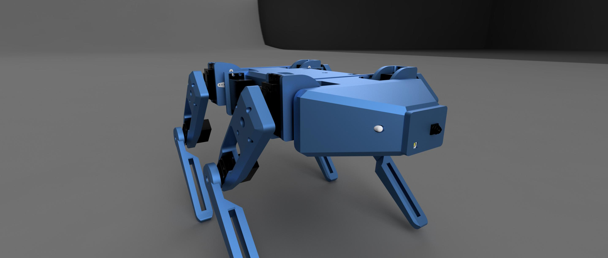

# Cooper - an evolving project to create an autonomous robotic platform

## Robot equipment

  1. x12 servo motors (mg996)
  2. x2 26650 5100 mAh cells
  3. PCA9685 I2C
  4. Arduino Pro Micro (Leonardo)
  5. ESP32 CAM
  6. Addressable LED strip
  7. LiDAR (from Xiaomi robot vacuum cleaner)
  8. x2 voltage converters
  9. Breadboard for soldering

## Project development
During the first year of development, we managed to create a 3D model and write code for the servos, LED lighting, and ESP32-CAM.

### mk1

### mk2

### mk3

